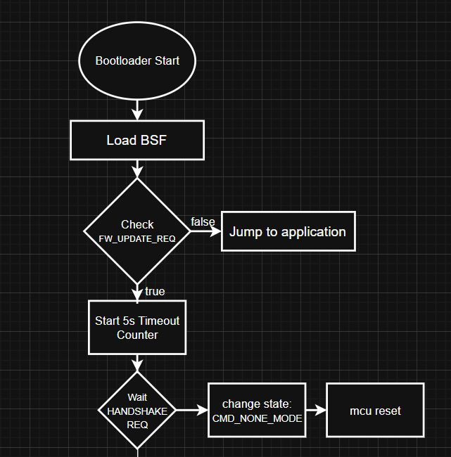
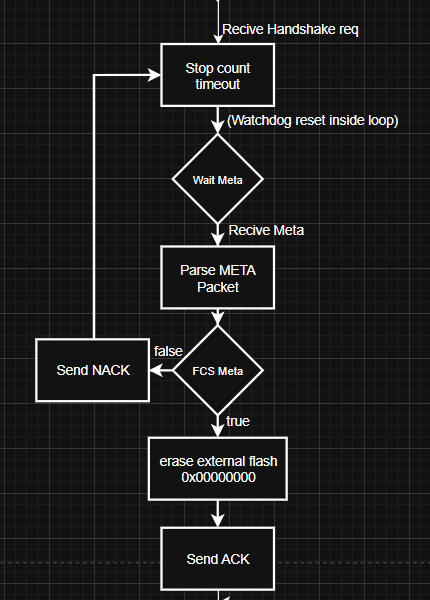
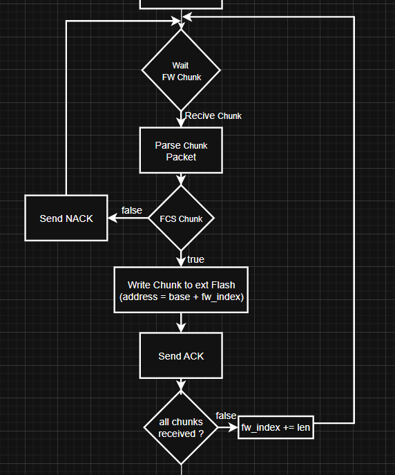
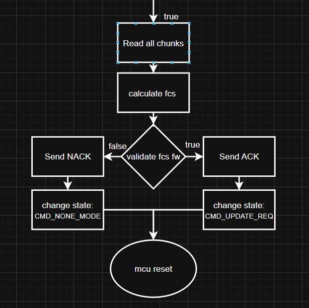

# STM32 UART Firmware Update (FWU) Bootloader Documentation
# I. Overview
This document explains the existing STM32 UART‑based Firmware Update (FWU) bootloader and how the PC host tool was rewritten to follow the MCU’s predefined update flow. The work involves implementing the host‑side .cpp logic, adding a SysTick‑based timeout, and adjusting the update process so firmware is first written to external flash before being copied into internal flash.

# II. Bootloader Architecture
| Region             | Address Range              | Description                          |
|--------------------|----------------------------|--------------------------------------|
| Bootloader         | 0x08000000 – 0x08001FFF    | 8 KB region, protected, runs on boot |
| BSF                | 0x08002000 – 0x08002FFF    | 4 KB, stores boot flags & headers    |
| Application FW     | 0x08003000                 | Main firmware                        |
| SRAM               | 0x20000000 – 0x20003FFF    | 16 KB runtime RAM                    |

# II. Firmware Update Flow (MCU)
### 1. Boot Stage

### 2. Handshake Stage and Meta Stage

### 3. Transfer Firmware Stage

### 4. Final Checksum Stage

